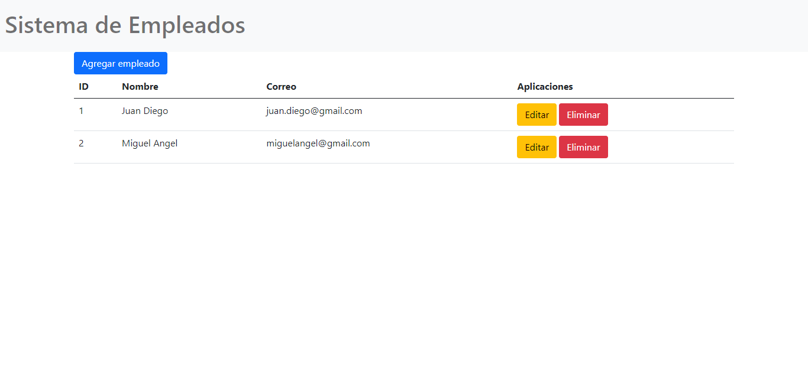
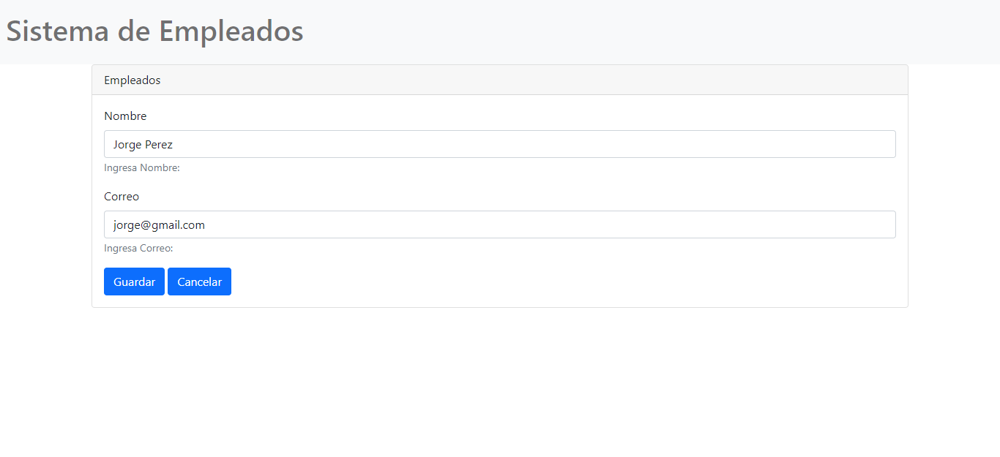
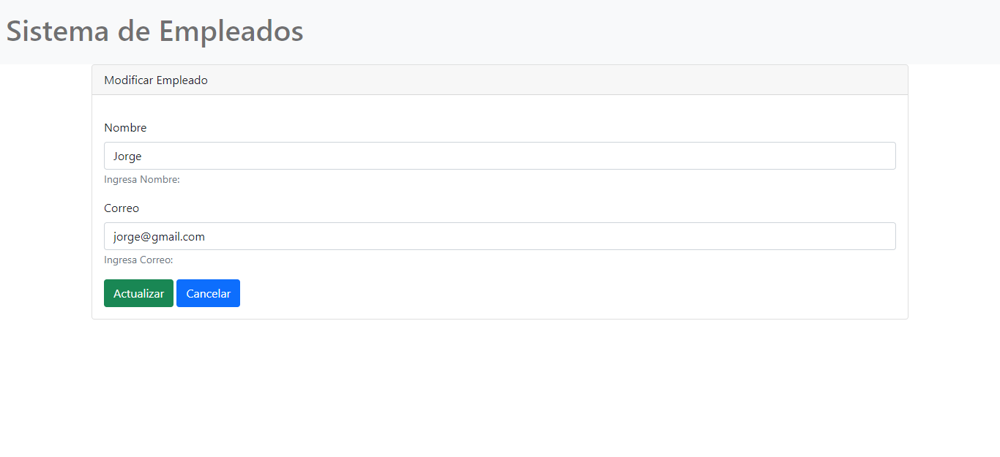

#   CRUD Empleados con Golang + Bootstrap

##  Home tabla empleados

    

##  FORMULARIO: Agregar nuevo empleado

    

##  FORMULARIO: Actualizar empleado

    

#   Iniciando el servidor
`go run main.go`

##  Direccion del servidor local
`http://localhost:8080/`